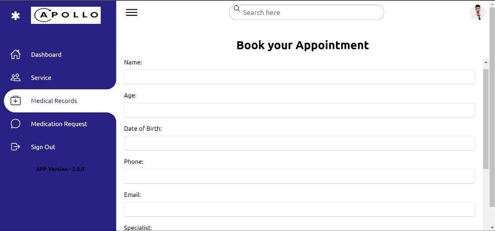
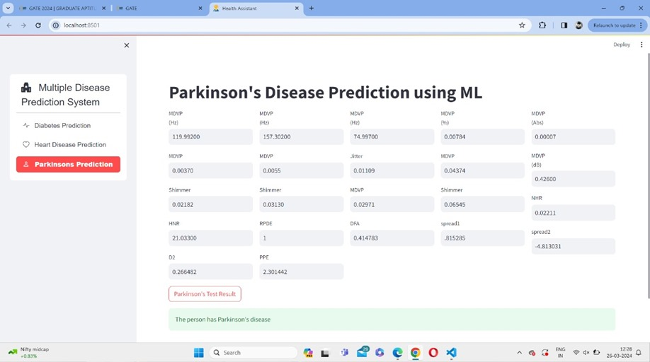
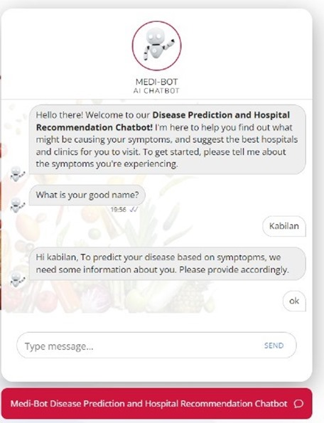
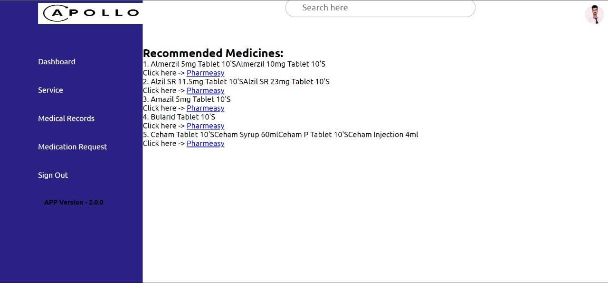
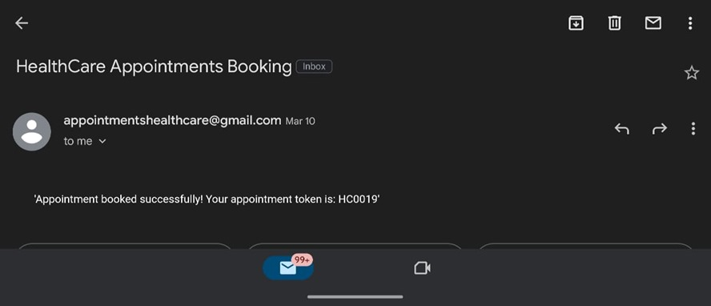

# Web-Based Patient Health Management System  
### With Doctor Recommendations and Medicine Alternatives Using Machine Learning  

## 📌 Overview  
This project is a **full-stack web application** that streamlines doctor appointments, recommends alternative medicines, and provides multi-disease predictions using **Machine Learning**. It features a **Flask-based backend**, a **responsive front-end**, and an integrated **database** for managing patient and doctor records.  

## 🚀 Features  

### **📅 Doctor Appointment Scheduling**  
Patients can seamlessly book doctor appointments through an intuitive web interface. The system optimizes appointment slots based on doctor availability, minimizing wait times and maximizing efficiency. Upon successful booking, the appointment details are stored in a **SQL-based database**, ensuring secure and organized data management.  

### **🩺 Multi-Disease Prediction**  
The system uses **Machine Learning (Random Forest Classifier)** to predict diseases such as **Diabetes, Heart Disease, and Parkinson’s** based on patient symptoms. Users can input their symptoms, and the model provides an accurate probability score for each disease, aiding early diagnosis and medical intervention.  

### **💬 Chatbot Integration**  
A built-in chatbot assists users by collecting symptom inputs and mapping them to potential health conditions. The chatbot provides preliminary healthcare suggestions and connects patients with the most relevant doctors, improving accessibility to medical advice.  

### **💊 Alternative Medicine Recommendations**  
For patients with allergies or side effects from prescribed medications, the system suggests suitable **alternative medicines**. This feature is designed to provide safe and effective options, ensuring continued treatment without adverse reactions.  

### **📩 Email Notification System**  
The system sends **automated confirmation emails** upon successful appointment bookings, including details such as the doctor’s name, appointment date, and consultation location. It also sends **reminder emails** before the scheduled appointment to reduce no-show rates and improve patient compliance.  

## 🔧 Full-Stack Technologies Used  

### **🖥 Backend**  
- **Flask (Python)** – Handles API requests, machine learning model execution, and user authentication.  
- **Machine Learning Models** (for disease prediction & recommendations):  
  - **Random Forest Classifier** (Primary Model)  
  - Logistic Regression  
  - Decision Tree  
  - Support Vector Machine (SVM)  
  - k-Nearest Neighbors (KNN)  

### **🌐 Frontend**  
- **HTML, CSS, JavaScript** – Builds an interactive and responsive UI.  
- **Bootstrap** – Ensures a mobile-friendly design.  

### **🗄 Database & Storage**  
- **SQL-based Database** – Stores patient records, doctor profiles, and appointment history.  

### **📡 Other Tools & Integrations**  
- **Chatbot** – Guides users in symptom analysis and healthcare suggestions.  
- **Email API** – Sends appointment confirmations and reminders.  

## 📊 Model Performance  
The **Random Forest Classifier** demonstrated the best performance across accuracy, precision, and recall compared to other models.  

| Model | Accuracy | Precision | Recall |  
|--------|----------|----------|--------|  
| Random Forest | 80.42% | 69.82% | 75.15% |  
| Decision Tree | 80.42% | 69.82% | 74.42% |  
| KNN | 78.13% | 68.17% | 72.63% |  
| SVM | 8.77% | 0.54% | 2.81% |  
| Logistic Regression | 6.02% | 0.09% | 1.26% |  

---

This README now clearly highlights **each feature** while keeping the full-stack development details at the core. Let me know if you'd like any further refinements! 🚀
